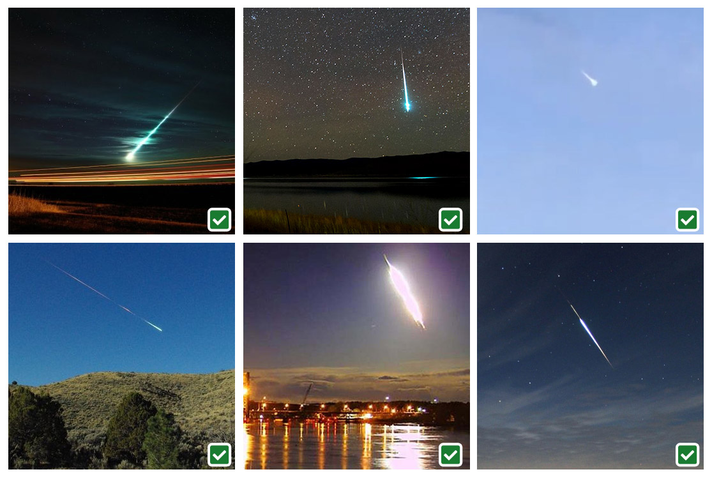

# Fireballs 
Red sprites are a weather phenomenon that appear as luminous red-orange flashes that could be mistaken for UFOs. Scientifically, 
> A fireball is another term for a very bright meteor, generally brighter than magnitude -4, which is about the same magnitude of the planet Venus as seen in the morning or evening sky.  
> [FIREBALLS - American Meteor Society](https://www.amsmeteors.org/fireballs/) 

### [Fireball Examples](https://www.amsmeteors.org/fireballs/fireball-or-contrail/)
 

## Data 
The American Meteor Society has a collection of verified Fireball logs at https://www.amsmeteors.org/fireballs/fireball-report/. Impact location data is within the downloadable kmz file for each event.

## Files
* `Fireball_Scraper.py`: Scrapes and formats fireball data from the American Meteor Society. Collects all reports within the US, appends lat/long data, and dumps serialized Pickle python dicionary called `fireball_data.p`.
* `Fireball_to_CSV.py`: Loads serialized dictionary `fireball_data.p`, creates `Fireballs.csv` and outputs scraped data to CSV compatible with GIS 
* `Fireballs.csv`: Output of `Fireball_to_CSV.py` as of December 12, 2022

## Python Module Dependencies
* `pickle` - Python object serialization
* `re` - Regular expression operations
* `datetime` - Basic date and time types
* `Selenium` - Webdriver
  * chrome driver
* `BeautifulSoup` - HTML parser
* `traceback`