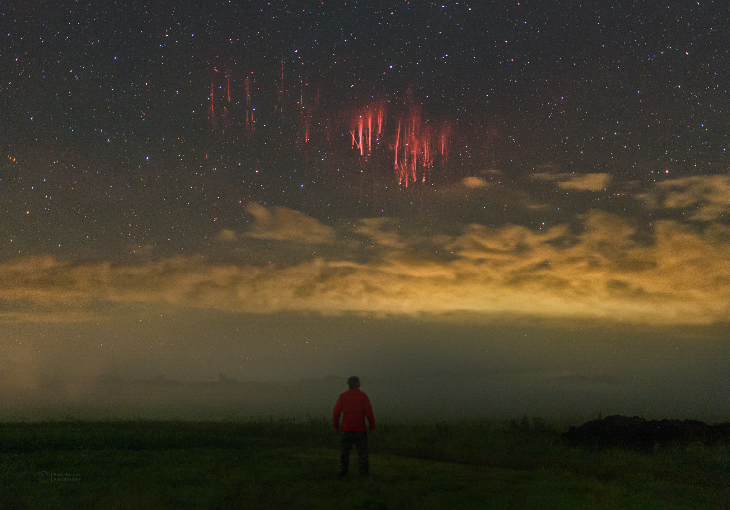
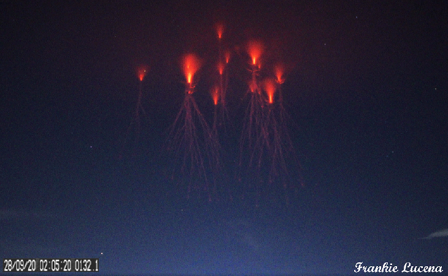

# Red Sprites 
Red sprites are a weather phenomenon that appear as luminous red-orange flashes that could be mistaken for UFOs. Scientifically, 
> Sprites or red sprites are large-scale electric discharges that occur high above thunderstorm clouds, or cumulonimbus, giving rise to a varied range of visual shapes flickering in the night sky. They are usually triggered by the discharges of positive lightning between an underlying thundercloud and the ground.  
> [Sprite (lightning) - Wikipedia](https://en.wikipedia.org/wiki/Sprite_(lightning)) 

| [Photo by Petr Horalek](https://spaceweathergallery.com/indiv_upload.php?upload_id=176463) | [Photo by Frankie Lucena](https://spaceweathergallery.com/indiv_upload.php?upload_id=168570) |
| --- | --- |
 |  |

## Data 
The largest dataset of Red Sprite sightings I was able to find was this photo set from https://spaceweathergallery.com/index.php?&title=sprite&starting_point=0

## Files
* `Sprite_Scraper.py`: Scrapes and formats sprite data from Spaceweather.com. Geocodes all sprites, removes non-US data points, and appends lat/long for relevant sightings. Dumps two serialized Pickle python dictionaries, `sprites.p` and `failed_sprites.p` 
* `Sprite_to_CSV.py`: Loads serialized dictionary `sprites.p`, creates `Sprites.csv` and outputs scraped data to CSV compatible with GIS
* `clean_sprites.py`: Optional run; Loads serialized `failed_cleaned_sprites.p` which was manually cleaned/reformatted from `failed_sprites.p`, geocodes and appends to `sprites.p`

## Python Module Dependencies
* `pickle` - Python object serialization
* `re` - Regular expression operations
* `datetime` - Basic date and time types
* `Nominatim` - Geocoder
* `Selenium` - Webdriver
  * chrome driver